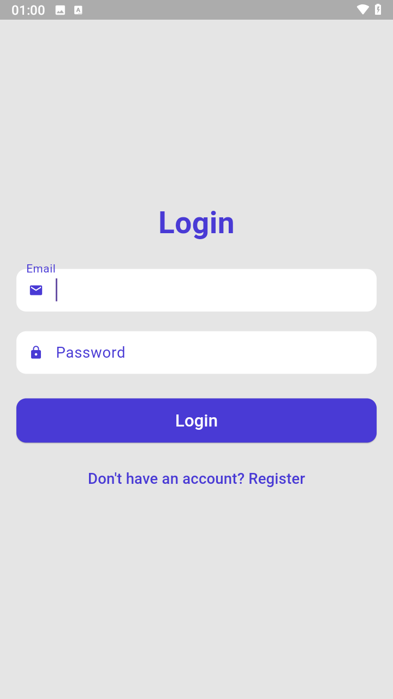
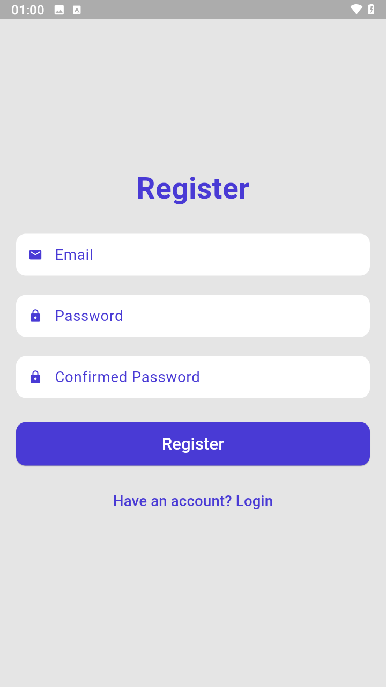

# **Flutter Auth**

Autenticação em Flutter com GetX.

## 📝 **Sobre o Projeto**

Este projeto foi desenvolvido com o propósito de estudo e prática no uso do Flutter junto com o GetX. Ele consiste em:

- Tela de **Login**: Validação de entrada e gerenciamento de estado com GetX.
- Tela de **Registro**: Criação de novos usuários com estrutura otimizada de controllers e validações.

A estrutura segue boas práticas de desenvolvimento e organização de código, proporcionando uma base sólida para futuros projetos.

---

## 📸 **Capturas de Tela**

### **Tela de Login**
<p align="center">
  
</p>

### **Tela de Registro**
<p align="center">
  
</p>

---

## 🚀 **Tecnologias Utilizadas**

- **Flutter**: Framework principal para o desenvolvimento do aplicativo.
- **GetX**: Gerenciamento de estado, navegação e dependências de forma simplificada.
- **Dart**: Linguagem de programação utilizada pelo Flutter.

---

## 📚 **Recursos Úteis**

Se você está iniciando no Flutter, aqui estão alguns recursos para começar:

- [Lab: Escrevendo seu primeiro app em Flutter](https://docs.flutter.dev/get-started/codelab)
- [Cookbook: Exemplos úteis de Flutter](https://docs.flutter.dev/cookbook)
- [Documentação oficial do Flutter](https://docs.flutter.dev/)

---

## 🔗 **Link do Repositório**

Explore o código no GitHub:

👉 [Flutter GetX Authenticate](https://github.com/thiagolazaro/flutter-getx-autenticate)

---

## 🤝 **Contribuições**

Sinta-se à vontade para clonar, experimentar e sugerir melhorias! 

```bash
# Clone o repositório
git clone https://github.com/thiagolazaro/flutter-getx-autenticate.git
